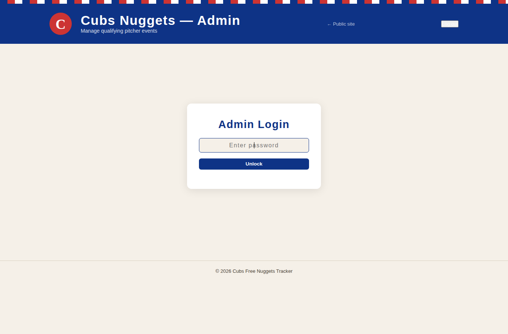

# 🟦 Nugget Tracker

[](https://github.com/Gogorichielab/nugget-tracker/actions/workflows/azure-static-web-apps-victorious-cliff-0a4b70b0f.yml) [](https://github.com/Gogorichielab/nugget-tracker/actions/workflows/mlb-sync-nightly.yml) [](https://github.com/Gogorichielab/nugget-tracker/actions/workflows/maintenance.yml)

Free Chick-fil-A nuggets. Every time a Cubs pitcher strikes out **3 batters in a single inning** at home.

We're keeping score so you don't have to. 🍟

## How It Works

1. **Cubs pitcher gets 3 K's** in one inning → ✨ Qualifying event
2. **Event gets logged** in real-time
3. **Free nuggets tomorrow** — Chick-fil-A honors the promo the next day

## What You'll Find Here

- 📊 **Public dashboard** — Track all qualifying events this season
- 🔐 **Admin panel** — Manage the event log (password protected)
- ⚾ **Auto-sync** — Nightly MLB data fetch keeps events up to date
- 🎨 **Cubs-themed UI** — Blue, red, gold, and cream colors

## Tech Stack

Built with:
- **Frontend**: Vanilla HTML, CSS, JavaScript (no build step)
- **Backend**: Node.js 18 Azure Functions
- **Storage**: Azure Table Storage
- **Hosting**: Azure Static Web Apps
- **CI/CD**: GitHub Actions

## Getting Started

For local setup and deployment instructions, see [agent.md](agent.md).

## Security

### Admin Authentication Hardening

Admin writes now use a dedicated auth flow:

- `POST /api/auth` accepts `{ "password": "..." }`
- The server validates the password with a derived hash (`crypto.scryptSync`)
- On success, the API returns a short-lived HMAC-signed bearer token (1 hour)
- Admin write endpoints (`POST/PUT/DELETE /api/events`) require `Authorization: Bearer <token>`

The admin UI no longer uses the legacy `x-admin-password` header and the
probe-and-delete login pattern has been removed. (`/api/mlb-sync` still accepts
the legacy header for scheduled-job backward compatibility.)

Required environment variables:

- `ADMIN_PASSWORD` (must be at least 12 chars with upper/lower/number/symbol)
- `ADMIN_TOKEN_SECRET` (must be at least 32 chars)



### OData Query Injection Protection

All values interpolated into Azure Table Storage OData filter strings are
escaped before use. The helper `api/utils/odata.js` exposes `escapeOData`,
which doubles every single quote in a string value (`'` → `''`) as required
by the OData specification. This prevents a crafted value — such as a pitcher
name containing `'` or a malicious route parameter — from breaking out of the
surrounding quotes and altering the query predicate.

```js
// api/utils/odata.js
function escapeOData(value) {
  return String(value).replace(/'/g, "''");
}
```

The helper is applied in:

| File | Filter field(s) |
|------|----------------|
| `api/events/index.js` | `id` (URL route parameter) used in `RowKey` filter |
| `api/mlb-sync/index.js` | `pitcher`, `gameDate`, `year` from MLB Stats API response; `inning` is coerced with `parseInt` |

> **Why this matters:** Without escaping, a pitcher name like `O'Brien` would
> produce a syntactically invalid OData expression. A deliberately crafted
> value such as `' or '1' eq '1` could match all rows, bypassing the
> deduplication guard in `mlb-sync` and allowing duplicate events to be
> inserted.
